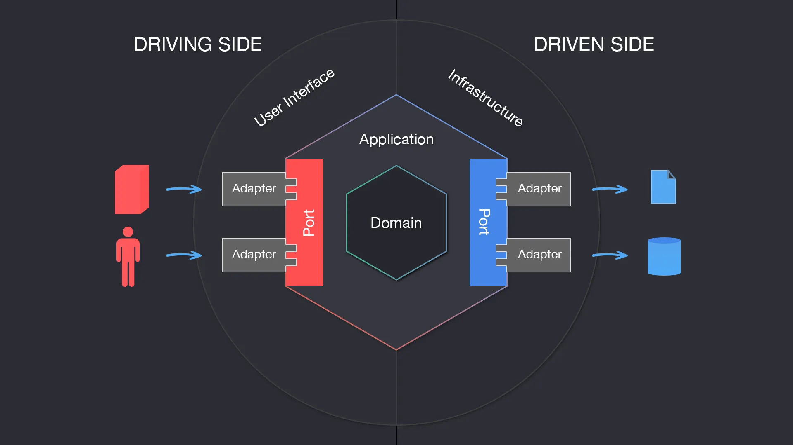

# Hexagonal architecture for Nest js

Implementing hexagonal architecture, for Nest js, where we have our domain logic which isn't affected by any external factors (web, persistence...), using the dependency inversion rule, our domain logic is the core of our application and all other components relay on it



## Domain

Our domain consists of **entities**, these could represent business entities that we can act upon, usually each entity has a unique id and a set of fields.

When it comes to entities manipulation this is where our **use cases** come into play, they allow us to perform actions on our entities

Commands act the input for our use cases to drive the business use case forward, all of these components shouldn't rely on any specific technology implementation (frameworks, database ORMS ...), they should only change, if our business requirements change.

In our application we will be building a wallet app where users can send money from their wallets.

### Entity
Entities are the heart of the domain logic, they represent real object in our business domain.

We will have a simple entity `Account`, which represents the users wallet, it's up to use to configure how complex/simple our entities can be, for instance apart from holding data (id, balance), our entity has helper functions that can perform operations on the provided account, (can withdraw, add money).

A good rule of thumb is to only have functions that act on the provided data for the entity (in our case balance), implementing more complex functionality should be part of of use cases (moving money between two different accounts).

```js
export class Account {
  constructor(private readonly id: string, private balance: number) {}

  getBalance() {
    return this.balance;
  }

  getId() {
    return this.id;
  }

  canWithdraw(amount: number) {
    return this.balance - amount >= 0;
  }

  withdraw(amount: number) {
    if (this.canWithdraw(amount)) {
      this.balance -= amount;
      return false;
    }

    return true;
  }

  deposit(amount: number) {
    this.balance += amount;

    return true;
  }
}
```

### Use cases
Given that we have our entities, now we need to build use cases around them, currently we want to implement a use case where we can move money from one account to another `send-money-use-case`,
This will be our first **in port**, this is the entry point to our domain logic, which can be called by adapters (more on adapters in the next section).

Our send money service implements the in port for send money use case, the job of the service/use-case:
- Take use case input
- Validate input
- Preform business logic
- Return output

```js
@Injectable()
export class SendMoneyService extends SendMoneyUseCase {
  constructor(
    @Inject(LoadAccountPort) private readonly loadAccountPort: LoadAccountPort,
    @Inject(UpdateBalancePort)
    private readonly updateBalancePort: UpdateBalancePort,
  ) {
    super();
  }

  @Transactional()
  async sendMoney(sendMoneyCommand: SendMoneyCommand): Promise<boolean> {
    const sourceAccount = await this.loadAccountPort.getById(
      sendMoneyCommand.getSenderAccountId(),
    );
    const targetAccount = await this.loadAccountPort.getById(
      sendMoneyCommand.getTargetAccountId(),
    );

    if (!sourceAccount || !targetAccount) {
      throw new NotFoundException('Account not found');
    }

    if (sourceAccount.getBalance() < sendMoneyCommand.getTransferAmount()) {
      throw new BadRequestException('Insufficient funds');
    }

    sourceAccount.withdraw(sendMoneyCommand.getTransferAmount());
    targetAccount.deposit(sendMoneyCommand.getTransferAmount());

    await this.updateBalancePort.updateBalance(
      sourceAccount,
      sourceAccount.getBalance(),
    );
    await this.updateBalancePort.updateBalance(
      targetAccount,
      targetAccount.getBalance(),
    );

    return true;
  }
}
```

Input with since is a mutation use case it takes a **command**, this command has the needed use case inputs and when created also does the validation part of the input.
We can also provide a custom builder class to make it easier to create commands, If this was a querying use case, we could replaces commands with query inputs or something similar.

```js
import * as Joi from 'joi';
import { CommandValidate } from '../command-validate';

export class SendMoneyCommand extends CommandValidate<{
  senderAccountId: string;
  targetAccountId: string;
  transferAmount: number;
}> {
  constructor(
    private readonly senderAccountId: string,
    private readonly targetAccountId: string,
    private readonly transferAmount: number,
  ) {
    super(
      Joi.object({
        senderAccountId: Joi.string().required(),
        targetAccountId: Joi.string().required(),
        transferAmount: Joi.number().positive().required(),
      }),
    );

    this.validate();
  }

  validate(): void {
    super.validate({
      senderAccountId: this.senderAccountId,
      targetAccountId: this.targetAccountId,
      transferAmount: this.transferAmount,
    });
  }

  getSenderAccountId(): string {
    return this.senderAccountId;
  }

  getTargetAccountId(): string {
    return this.targetAccountId;
  }

  getTransferAmount(): number {
    return this.transferAmount;
  }
}
```


## Adapters 

These are the external components that can interact with our domain use cases (in adapters), or can be called by our domain use cases (out adapters), the point of interaction between adapters and our domain use cases is **ports** to keep them decoupled from each other

### In Adapters

The first in adapter that we have, is **controllers**, they represent the entry point for our domain use cases for our clients. it's only job is to map user calls to our domain use cases, and prepare responses

Generally this can be a REST API, graphql, GRPC, in our case it's a REST API.

We can follow the usual grouping of different endpoints under on controller. But to stick to the theme we can have a controller per use case, this allows less coupling between endpoints.

If we have more than one endpoint in the same controller, we will likely use the same response model for all the endpoints (higher coupling), also test files will be easier to setup and smaller in terms of lines of code

We also have a different validation for the web layer, different from the use case command, again to have decoupling between our web layer and domain use case

```js
import { Body, Controller, Post, Res, ValidationPipe } from '@nestjs/common';
import { SendMoneyDTO } from './send-money.dto';
import { SendMoneyUseCase } from 'src/account/domain/ports/in/send-money.use-case';
import { Response } from 'express';

@Controller('account:send-money')
export class SendMoneyController {
  constructor(private readonly sendMoneyUseCase: SendMoneyUseCase) {}

  @Post()
  async sendMoney(
    @Body(new ValidationPipe({ transform: true })) body: SendMoneyDTO,
    @Res() res: Response,
  ) {
    await this.sendMoneyUseCase.sendMoney(body.toSendMonyCommand());
    res.status(200).json({ message: 'Money sent' });
  }
}

```

### Out Adapters

#### Persistence

Every project most likely has a need for storing and querying data, since this part internal details **is not part of our domain code**, it should be abstracted as well, as an out adapter (out since the domain code will be calling these adapters).

We will be using sequelize with postgresql to model our database.

##### Structure

Usually most projects have a repository layer for having functionalities for accessing the persistence layer, we will be doing something similar.

To start off we will define ports as part of our domain code to explain our need from the persistence layer, in our case we need to be able to view an account, and update it's balance (following single responsibility, and dependency inversion rule), this will be in two separate interfaces.

- Using sequelize we can define our new table `Account` with the needed columns.
- Create a new `AccountRepo` for using sequelize for querying the db, having a repository makes it easy to reuse common complex quires in multiple places (complex search queries..)
- And then finally our persistence adapter that implements the out ports, in terms of creating a persistence layer we have multiple options:
  - one general broad adapter, this can implement all the interfaces and have access to all the repos, acts as a central point for use cases to interact with the out port
  - adapter per (aggregate) entity, this is more common where for each entity we have a single adapter.
  - adapter per bounded context, for each bounded context we have a single adapter that implements it's needs for the persistence layer

Since this is a simple project we only have one adapter for one entity, but be wary of the following points when creating an adapter layer:

```js
import { Injectable } from '@nestjs/common';
import { AccountRepo } from './account.repo';
import { LoadAccountPort } from 'src/account/domain/ports/out/presistence/load-account.port';
import { UpdateBalancePort } from 'src/account/domain/ports/out/presistence/update-balance.port';
import { Account } from 'src/account/domain/entities/Account';
import { AccountPersistenceEntity } from './account.entity';

@Injectable()
export class AccountPersistenceAdapter
  implements LoadAccountPort, UpdateBalancePort
{
  constructor(private readonly accountRepo: AccountRepo) {}

  async getById(id: string): Promise<Account | null> {
    const account = await this.accountRepo.getById(id);
    return account ? this.mapToDomain(account) : null;
  }

  async updateBalance(account: Account, amount: number): Promise<void> {
    await this.accountRepo.updateBalance(account.getId(), amount);
  }

  private mapToDomain(entity: AccountPersistenceEntity) {
    return new Account(entity.id, entity.amount);
  }

  private mapToPersistence(domain: Account) {
    return {
      id: domain.getId(),
      amount: domain.getBalance(),
    };
  }
}
```
It's also responsible for mapping between our domain entity and our persistence layer representation

 - The bigger the adapter the harder it's to setup for testing/mock
 - not all use cases might need the functionally provided by one single big adapter

As for transactions, I opted for a package that uses the `@Transactional` annotation for each use case (assuming each use case is supposed to be atomic), there are other solutions to this, as long as we don't leak the transaction details to our domain logic (use cases), we can create an interface for a transaction and have a transaction manager class that creates such transactions, these can be created by our use cases, and passed to the persistence adapter down to our sequelize functions.

## Notes

### Mapping models between layers
Although we used hexagonal architecture for the project, at its core it's still a normal web app with several layers (web, application/domain, persistence), so there is still a path way for each request that goes through each layer.
This calls for a **mapping strategy** between layers, how can we pass input/output from one layer to the next, should we change anything or use one model or something in between.

#### No mapping strategy
Given our send money use case, we can some what use the `Account` model for all layers, as in web layer send the command to the application layer, application layer calls the persistence by passing the `Account` model, which is used for persistence, at the end the application layer returns an instance of the `Account` model to the web layer, which is returned as a response to the user.

This means we can get rid of the `AccountPersistenceEntity` class which is used to represent our account table in the persistence layer, and instead use the annotations on the `Account` model, we might also need further annotations on our `Account` class for serialization options for the web layer. All and all our `Account` class might look something like this:

```js
@Table({ tableName: 'account' })
@ApiModel({
  description: 'Represents a bank account entity with unique identifier and balance',
})
export class Account {
  @ApiProperty({
    description: 'The unique identifier of the account',
    example: '550e8400-e29b-41d4-a716-446655440000',
  })
  @Column({ type: DataType.UUID, primaryKey: true })
  id: string;

  @ApiProperty({
    description: 'The current balance of the account',
    example: 1000,
    minimum: 0,
  })
  @Column({ type: DataType.INTEGER, defaultValue: 0 })
  balance: number;

  constructor(id: string, balance: number) {
    this.id = id;
    this.balance = amount
  }

  getBalance() {
    return this.balance;
  }

  getId() {
    return this.id;
  }

  canWithdraw(amount: number) {
    return this.balance - amount >= 0;
  }

  withdraw(amount: number) {
    if (this.canWithdraw(amount)) {
      this.balance -= amount;
      return false;
    }

    return true;
  }

  deposit(amount: number) {
    this.balance += amount;

    return true;
  }
}
```

Our domain model might seem a bit clustered now, too many annotations plus the helper functions, given any change in any of the layers, this could lead to a change in our domain model.

##### Pros
- A simpler model, no need for complex mapping strategy between each layer

##### Cons
- high coupling between layers
- Some fields might be required by some layers, but not needed by others (e.x `is_deleted` can be used only in the persistence layer), which can lead to additions of a few fields that are used in some layers only
- Bloated domain model 

A no mapping strategy is still valid, either at a starting point of the project where speed is crucial and the model is still simple and in the early stages, as well if all layers need the same exact fields of the model (mapping would essentially map the domain model to another model with the same exact fields). 

#### Two way mapping strategy
Each layer (web, application, persistence) has it's own model, and usually the web and persistence layer perform the mapping from their model to the application model or the other way around from the application model to their model (hence the two way mapping name), similar to what we did to our persistence layer, where we have two functions to map from our ORM model -> application model and vice versa.

It's important to note that even in our mapping strategies we still must stick to ur hexagonal architecture rule of having the domain code not be aware of any external dependencies as in our domain code shouldn't have any mapping functions to map to web models or persistence models.

##### Pro
- Less coupling between layers
- Allows each model to evolve independently 
- Fine grained models, allows our application model to focus only on domain logic

##### Cons
- Added complexity and time for mapping between layers
- Harder to debug if there are problems

It seems like this is a rule of thumb, that two way mapping is a safe way to go when it comes to mapping models.

#### Full mapping
Opposite to no mapping strategy, this does a full on mapping between every interaction that concerns two different layers, in our example of that is the `SendMoneyCommand` the web layer has it's own input, which it has to transfer into the `SendMoneyCommand`, internally in our application logic we also have to break the `SendMoneyCommand` into the two accounts involved in the use case and so on.

We could've done the same with the interaction between the use case and the out persistence port (seemed over kill).

##### Pros
- Highest degree of decoupling, each layer determines has it's own input shape and can validate it (similar to our send money command)

##### Cons
- Could add a high degree of complexity

Generally this is advised to be used only when there are interactions between the in ports and our use cases (in our case the controller and our send money use case), having our application layer validate it's own input and define it, protects it more from external dependencies.

#### One way mapping
Another way is allowing each layer (web, application, persistence) to have it's **own model** but all of them **implement the same interface**, thus makes them replaceable by one another.
Imagine we have an `AccountInterface` which has the main fields that we need (id, balance), we can have `WebAccountModel` ,`Account` and `PersistenceModel` all implementing the same interface, but each adding their own functionality on top of it (web -> swagger annotations, application -> helper methods, persistence -> column definitions)

##### Pros
- Allows each layer to extend the base model to suit it's usage best

##### Cons
- Can be hard to define what should be included in the interface and what not
- Given the other mapping strategies this is the hardest to get right as you are trying to create a single interface that works across layers.

### Dependency injection
A crucial part of why this architecture works is dependency injection, our application code (services) doesn't need to initiate any classes that it needs similar to the persistence layer classes, dependencies are passed in through the constructor instead, using our defined ports (which makes them easily mockable)

### Architecture boundaries  
When project get bigger, it's easier to break architecture rules and take shortcuts (application code, communicates with persistence instead of out ports, entities access persistence layer...), so it's better to have an automated way to enforce those rules (while allowing exceptions if needed).

#### TS-arch
Since the layout of our architecture is constant (the direction of dependency is inward from external adapters all the way towards application code and domain), and our folder structure as well maps out to our architecture, it should be easy to automate the process of verifying the adherence to our architecture rules.

```js
describe('Account Arch test', () => {
  jest.setTimeout(600000);

  describe('entities', () => {
    it('should not import any files outside the entities folder', async () => {
      const violations = await filesOfProject()
        .inFolder('src/account/domain/entities')
        .shouldNot()
        .matchPattern('*.ts')
        .check();

      expect(violations).toHaveLength(0);
    });
  });

  describe('services', () => {
    it('should not depend on files in the adapters folder', async () => {
      const violations = await filesOfProject()
        .inFolder('src/account/application/services')
        .shouldNot()
        .dependOnFiles()
        .inFolder('src/account/adapters')
        .check();

      expect(violations).toHaveLength(0);
    });
  });
});
```

You can use whatever way that suits your project, but one way is having automated tests to check package imports, for example currently our domain code doesn't have any imports, same for ou application services, they should'nt depend on any external adapters.


## References
- Hexagonal Software Architecture for Web Applications course on educative.io
